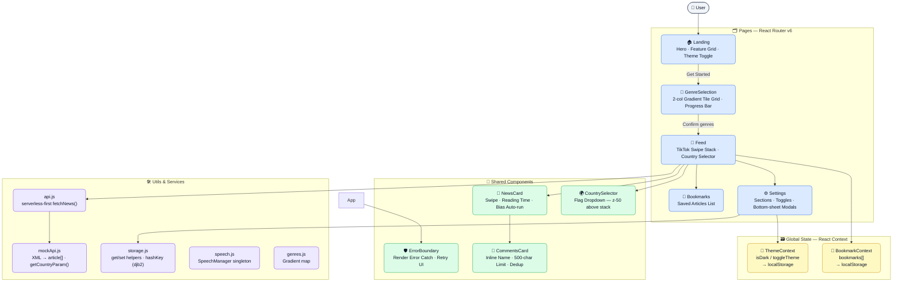
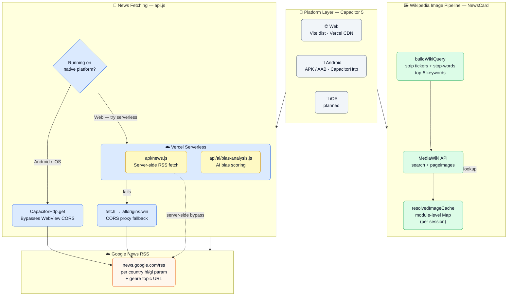
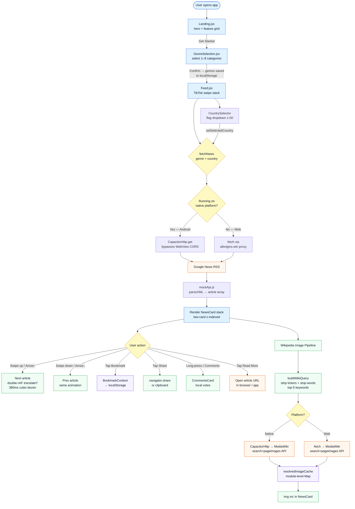
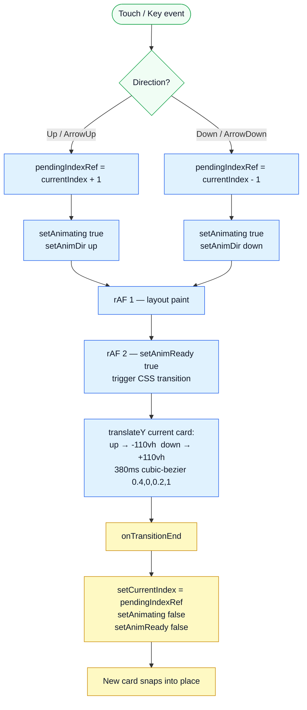
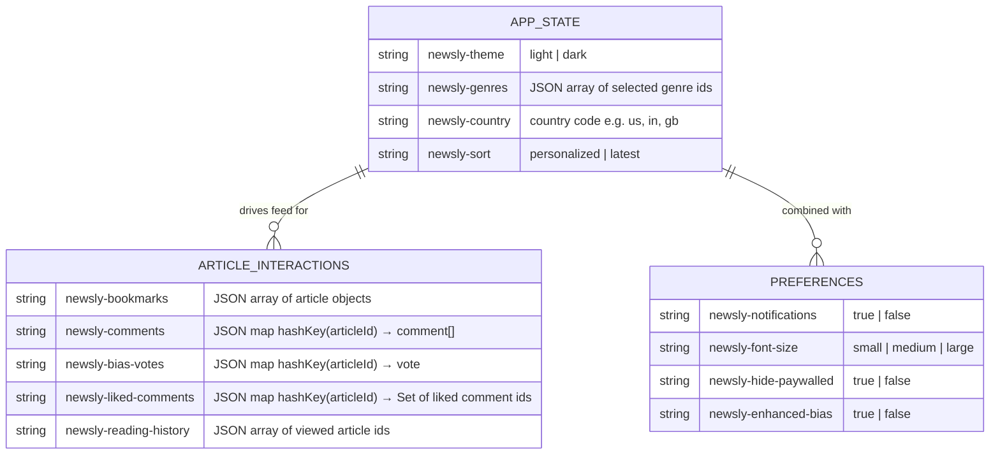

# Newsly — Ultra-Short News App

A React-based cross-platform news app that delivers ultra-short (≈60-word) news stories with swipeable cards. Built with React + Capacitor for web and native mobile deployment.

# 📸 Screenshots — Google Pixel 9

| Landing Page | Genre Selection |
|:---:|:---:|
|  |  |

| News Feed | Settings |
|:---:|:---:|
|  |  |

## 🚀 Features

### 📱 Core Experience
- **Cross-Platform**: Runs on Web, Android (APK/AAB), and iOS (planned) via Capacitor 5
- **Ultra-Short Summaries**: News stories condensed to ~60 words — no fluff, just facts
- **TikTok-style Swipe**: Two-card stack with `translateY` transitions, double-rAF two-phase animation, 380ms cubic-bezier easing — swipe or use arrow keys
- **Real-time News**: Live Google News RSS feeds, auto-refreshes on country or genre change without a full page reload
- **Infinite Scroll**: Automatically appends more articles (deduped by URL) when within 3 cards of the end
- **Reading Time**: Per-article word-count estimate displayed on each card (~200 wpm)

### 🎨 UI & Design
- **Dark / Light Mode**: Toggle on every screen — Landing, Genre Selection, Feed, and Settings; defaults to light, persisted to localStorage
- **Redesigned Landing Page**: Hero layout with 2-column feature grid (Zap / Globe2 / Bookmark / ShieldCheck), theme toggle, and Skip button
- **Redesigned Genre Selection**: Dark 2-column tile grid with per-genre gradient colors, animated checkmark badge on selected tiles, scale bump, sticky progress bar + CTA
- **Redesigned Settings Page**: Profile strip with gradient icon, grouped Section cards (rounded-2xl), SettingRow with colored icon pills + Toggle switch, bottom-sheet backdrop-blur modals
- **Swipe-proof Header**: Touch events outside the card are captured to prevent the header from being dragged away — inner text panel remains independently scrollable

### 🔍 Search
- **Debounced Search**: 400ms debounce so results only filter after you stop typing
- **Article / Newspaper Toggle**: Switch between searching article titles+descriptions vs. source names (e.g. "BBC", "Reuters", "The Hindu")
- **Inline No-Results Fallback**: When a search yields zero results, a friendly card replaces the stack with hint text and quick-action buttons (Clear search / Switch mode) — you never leave the feed
- **Typing Indicator**: "Searching…" overlay shown during the debounce window

### 🌍 Personalisation
- **Country Selection**: 15+ countries with flag indicators — news scoped to your region, passed server-side via `countryParam`
- **Genre Selection**: 8 categories — Technology, World, Business, Sports, Science, Health, Entertainment, Politics
- **Default Sort**: Toggle between Personalized feed or Latest news
- **Hide Paywalled Articles**: Filter out articles from 30 known paywalled sources (expanded from 9)
- **Font Size**: Small / Medium / Large reading preference

### 🖼️ Smart Images
- **Wikipedia Image Pipeline**: MediaWiki search+pageimages API with keyword extraction, financial stop-word filtering, per-session module-level cache, and `CapacitorHttp` on Android native to bypass WebView CORS

### 🔖 Saves & Social
- **Bookmarking**: Save articles to a dedicated Bookmarks page, persisted to localStorage
- **Comments System**: Inline name prompt, 500-character limit with live counter, like deduplication keyed by `hashKey` — no `window.prompt()`, no repeat likes
- **Share Functionality**: Native share sheet on mobile, clipboard fallback on web
- **Read Aloud**: `SpeechManager` singleton (Web Speech API TTS) — listen to articles hands-free

### 🧠 AI & Analysis
- **Bias Analysis**: Community bias panel + vote sheet keyed by `hashKey`
- **Enhanced Bias Mode**: When enabled in Settings, auto-runs `/api/ai/bias-analysis` on every article load and pre-fills the score

### 🛡️ Reliability & Security
- **Error Boundary**: React class component wraps the entire app — catches render crashes, shows "Try again" UI
- **`hashKey` (djb2)**: All `localStorage` keys derived from article IDs use a collision-resistant djb2 hash instead of `btoa()` — safe against special characters and encoding collisions
- **Serverless-First Fetching**: `api.js` tries `/api/news` (Vercel serverless, true server-side CORS bypass) first; falls back to `allorigins.win` CORS proxy for local dev / fallback
- **Progress Indicator**: `X / Y` counter below the card stack

### ⚙️ Settings
- **Appearance**: Dark/light theme toggle
- **Feed**: Hide paywalled (30 domains), default sort mode, Enhanced Bias Analysis
- **Notifications**: On/off toggle
- **Account**: Bookmarks, Subscriptions (stub), Clear History, Feedback, Help & Support
- **Danger Zone**: Log out (clears localStorage)

## 📅 Development Timeline

| Date | Version | Updates |
|------|---------|---------|
| 19/03/2026 | v3.1.0 | 🔍 Search, Reliability & UX Polish<br/>• **Debounced search** (400 ms) with **Article / Newspaper toggle** - filter by title+description or by source name.<br/>• **Inline no-results fallback** - friendly card with Clear search and Switch mode CTAs replaces card stack; never kicks user out of the feed.<br/>• **Typing indicator** overlay during debounce window.<br/>• **ErrorBoundary** component wraps entire app - catches render crashes with Try again UI.<br/>• **`hashKey` (djb2)** replaces `btoa()` for all localStorage keys - collision-resistant, safe against special characters.<br/>• **CommentsCard rewrite** - inline name prompt (no `window.prompt()`), 500-char limit with live counter, like deduplication per article.<br/>• **`SpeechManager` singleton** (`speech.js`) replaces ad-hoc inline speech code in NewsCard.<br/>• **Reading time** estimate per article (word-count / 200 wpm).<br/>• **Enhanced Bias auto-run** - when enabled in Settings, bias score fetched automatically on article load.<br/>• **Serverless-first fetch** - `api.js` now tries `/api/news` (Vercel, true server-side bypass) before CORS proxy fallback.<br/>• **Country-aware serverless** - `api/news.js` accepts `countryParam` query param; builds country-scoped RSS URLs server-side.<br/>• **Infinite scroll** - auto-appends more articles (URL-deduped) when within 3 cards of end.<br/>• **Progress indicator** - X / Y counter below card stack.<br/>• **No reload on country change** - `loadNews(forceRefresh, countryOverride)` replaces `window.location.reload()`.<br/>• **Swipe-proof header** - `touchAction: none` plus gesture capture on main prevents header from being swiped away; inner text panel independently scrollable.<br/>• **Paywall list expanded** 9 to 30 domains (Telegraph, Wired, HBR, Nature, Barrons, regional papers, AFR, etc.).<br/>• Dead code removed: `HeaderBar.jsx`, `SettingsModal.jsx`, `UnderConstruction.jsx`. |
| 19/03/2026 | v3.1.0 | 🔍 Search, Reliability & UX Polish<br/>• **Debounced search** (400 ms) with **Article / Newspaper toggle** - filter by title+description or by source name.<br/>• **Inline no-results fallback** - friendly card with Clear search and Switch mode CTAs replaces card stack; never kicks user out of the feed.<br/>• **Typing indicator** overlay during debounce window.<br/>• **ErrorBoundary** component wraps entire app - catches render crashes with Try again UI.<br/>• **`hashKey` (djb2)** replaces `btoa()` for all localStorage keys - collision-resistant, safe against special characters.<br/>• **CommentsCard rewrite** - inline name prompt (no `window.prompt()`), 500-char limit with live counter, like deduplication per article.<br/>• **`SpeechManager` singleton** (`speech.js`) replaces ad-hoc inline speech code in NewsCard.<br/>• **Reading time** estimate per article (word-count / 200 wpm).<br/>• **Enhanced Bias auto-run** - when enabled in Settings, bias score fetched automatically on article load.<br/>• **Serverless-first fetch** - `api.js` now tries `/api/news` (Vercel, true server-side bypass) before CORS proxy fallback.<br/>• **Country-aware serverless** - `api/news.js` accepts `countryParam` query param; builds country-scoped RSS URLs server-side.<br/>• **Infinite scroll** - auto-appends more articles (URL-deduped) when within 3 cards of end.<br/>• **Progress indicator** - X / Y counter below card stack.<br/>• **No reload on country change** - `loadNews(forceRefresh, countryOverride)` replaces `window.location.reload()`.<br/>• **Swipe-proof header** - `touchAction: none` plus gesture capture on main prevents header from being swiped away; inner text panel independently scrollable.<br/>• **Paywall list expanded** 9 to 30 domains (Telegraph, Wired, HBR, Nature, Barrons, regional papers, AFR, etc.).<br/>• Dead code removed: `HeaderBar.jsx`, `SettingsModal.jsx`, `UnderConstruction.jsx`. |
| 15/03/2026 | v3.0.0 | 🎨 Full UI Overhaul & Bug Fixes<br/>• **TikTok-style swipe animation**: two-card stack with `translateY` transitions, double-rAF two-phase animation, 380 ms cubic-bezier easing.<br/>• **Wikipedia Smart Images**: switched from page/summary to MediaWiki search+pageimages API; keyword extraction strips financial stop words; per-session module-level cache; `CapacitorHttp` on Android native to bypass WebView CORS.<br/>• **Flicker & white-flash fixes**: removed synchronous `setResolvedImage(null)` and `isTransitioning` opacity animation from Feed.<br/>• **Country dropdown z-index fix**: Feed header gets `relative z-50` so selector renders above card stack.<br/>• **Landing page redesign**: dark/light hero layout, 2-column feature grid (Zap / Globe2 / Bookmark / ShieldCheck icons), sun/moon toggle, Skip button.<br/>• **Genre Selection redesign**: dark 2-column square tile grid with per-genre gradient colors, checkmark badge on selected tiles, scale bump, sticky progress bar + CTA.<br/>• **Settings page redesign**: Profile strip with gradient icon, grouped Section cards (rounded-2xl), SettingRow with colored icon pills + Toggle switch, bottom-sheet backdrop-blur modals; sections: Appearance / Feed / Notifications / Account / Support / Danger zone.<br/>• **Theme toggle** added to Landing and Genre Selection (uses existing ThemeContext, defaults to light).<br/>• ~15 miscellaneous bug fixes (Bengali locale, Android build, image cache race conditions, etc.) |
| 16/08/2025 | v2.3.0 | 🎨 Layout Refresh & Settings Expansion<br/>• New compact header in Feed with country selector, refresh, sort (Personalized/Latest), theme and settings buttons.<br/>• “Swipe up” affordance and smoother card transitions.<br/>• Read Aloud controls and keyboard shortcuts (Arrow Up/Down, Ctrl+Space).<br/>• Community Bias features: analysis panel + vote sheet with local persistence.<br/>• Article translation with LibreTranslate/Lingva fallback.<br/>• Settings additions: Theme, Notifications, Reading font size, Hide paywalled, Default sort, Bookmarks, Subscriptions (stub), Clear history, Feedback, Help & Support, Logout |
| 16/08/2025 | v2.2.0 | 🖼️ Smart Image Resolver & Reliability<br/>• Prefer original article URL (bypass Google News redirect).<br/>• Extract images from OG/Twitter/JSON‑LD/srcset and follow canonical links.<br/>• Openverse photograph fallback when no image is found.<br/>• Web image proxying for reliability (Weserv).<br/>• Improved handling of placeholder/flag images |
| 30/01/2025 | v2.1.0 | 🌍 Country Selection Feature<br/>• Added 15+ country support with flag indicators.<br/>• Auto-refresh on country change.<br/>• Visual loading states for country selector.<br/>• Improved refresh button feedback |
| 29/01/2025 | v2.0.0 | 🔧 Major UI/UX Improvements<br/>• Fixed mobile external URL navigation.<br/>• TikTok-style swipe navigation.<br/>• Dark/Light theme toggle.<br/>• Comments system with local storage.<br/>• Responsive design for mobile/desktop.<br/>• Share functionality.<br/>• Capacitor integration for mobile apps.<br/>• Mobile "Read More" button fixes |
| 28/01/2025 | v1.5.0 | 📱 Mobile Optimization<br/>• Enhanced swipe gestures.<br/>• Improved touch responsiveness.<br/>• Better mobile UI components |
| 27/01/2025 | v1.0.0 | 🎉 Initial Release<br/>• Core news fetching functionality.<br/>• Genre selection.<br/>• Basic UI components.<br/>• Web deployment ready |

## 🏗️ Architecture Overview

### App Layer



---

### Data & Platform Layer



## 🔄 News Feed Flow



---

## 🔀 Swipe Animation Flow



---

## 🗂️ localStorage Data Model



## 🛠️ Tech Stack

### Frontend
- **React 18** - UI framework with hooks
- **Vite** - Build tool and dev server
- **React Router** - Client-side routing
- **Tailwind CSS** - Utility-first styling
- **Lucide React** - Icon library
- **Framer Motion** - Animations (optional)

### Mobile
- **Capacitor** - Cross-platform native runtime
- **Capacitor HTTP** - Native HTTP requests
- **Android SDK** - Android app compilation
- **Xcode** - iOS app compilation

### Backend/API
- **Google News RSS** - News data source
- **XML Parser** - RSS feed processing
- **CORS Proxy** - Web development (allorigins.win)
- **Country API** - Country-specific news feeds

### Storage
- **localStorage** - Client-side data persistence
- **No Database** - Fully client-side application

## 📁 Project Structure

```
newsly/
│
├── src/                              # React application source
│   │
│   ├── App.jsx                       # Root component — React Router route definitions
│   ├── main.jsx                      # Entry point — mounts React + global CSS
│   ├── index.css                     # Tailwind base imports + custom global styles
│   │
│   ├── pages/                        # Full-screen route pages
│   │   ├── Landing.jsx               # Hero onboarding — feature grid, dark/light toggle
│   │   ├── GenreSelection.jsx        # 2-col gradient tile grid, progress bar, theme toggle
│   │   ├── Feed.jsx                  # News feed — TikTok swipe stack, country selector
│   │   ├── Settings.jsx              # Full-page settings — sections, toggles, modals
│   │   └── Bookmarks.jsx             # Saved articles list
│   │
│   ├── components/                   # Reusable UI building blocks
│   │   ├── NewsCard.jsx              # Article card — image pipeline, reading time, bias auto-run
│   │   ├── CommentsCard.jsx          # Inline comments — name prompt, 500-char limit, like dedup
│   │   ├── CountrySelector.jsx       # Flag dropdown (z-50, above card stack)
│   │   └── ErrorBoundary.jsx         # Class component — render error catch + retry UI
│   │
│   ├── contexts/                     # React context providers
│   │   ├── ThemeContext.jsx          # isDark state, toggleTheme(), localStorage sync
│   │   └── BookmarkContext.jsx       # bookmarks[], add/remove, localStorage sync
│   │
│   └── utils/                        # Pure helpers and service modules
│       ├── api.js                    # fetchNews() — serverless-first, CORS proxy fallback
│       ├── mockApi.js                # XML → article[] parser · getCountryParam() export
│       ├── genres.js                 # Genre definitions + GENRE_STYLES gradient map
│       ├── storage.js                # get/set helpers · hashKey(str) djb2 export
│       ├── constants.js              # PAYWALLED_DOMAINS (30), countries, flags
│       ├── speech.js                 # SpeechManager singleton — TTS read-aloud
│       └── __tests__/
│           └── countryNews.test.js   # Jest unit tests for country news fetching
│
├── api/                              # Vercel serverless functions
│   ├── news.js                       # /api/news — server-side RSS fetch (CORS bypass)
│   └── ai/
│       └── bias-analysis.js          # /api/ai/bias-analysis — AI bias scoring endpoint
│
├── android/                          # Capacitor Android project (auto-generated)
│   ├── app/
│   │   ├── src/main/
│   │   │   ├── AndroidManifest.xml   # Permissions: internet, vibrate
│   │   │   ├── java/com/newsly/app/
│   │   │   │   └── MainActivity.java # Capacitor bridge entry point
│   │   │   └── res/                  # Icons, splash screens, layouts
│   │   └── build.gradle
│   ├── capacitor.build.gradle
│   ├── variables.gradle              # SDK version pins
│   └── local.properties              # sdk.dir path (machine-local, gitignored)
│
├── index.html                        # Vite HTML shell
├── vite.config.js                    # Vite build config
├── tailwind.config.js                # Tailwind theme + dark mode: 'class'
├── postcss.config.js                 # PostCSS (Tailwind + Autoprefixer)
├── capacitor.config.json             # App ID, webDir, CapacitorHttp plugin config
├── jest.config.js                    # Jest test runner config
├── vercel.json                       # Vercel routing / function config
└── package.json                      # Scripts, dependencies
```

## 🔧 API Architecture

### News Fetching Strategy

```javascript
// Platform Detection
if (window.Capacitor?.isNativePlatform()) {
  // Native: Use Capacitor HTTP (bypasses CORS)
  const response = await CapacitorHttp.get({
    url: googleNewsRssUrl,
    headers: { 'User-Agent': 'NewsBot/1.0' }
  });
} else {
  // Web: Use CORS proxy
  const response = await fetch(corsProxyUrl + googleNewsRssUrl);
}
```

### Country-Specific RSS URLs

```javascript
const getCountrySpecificUrl = (category, country) => {
  const baseUrls = {
    'technology': 'https://news.google.com/rss/topics/CAAqJggKIiBDQkFTRWdvSUwyMHZNRFZxYUdjU0FtVnVHZ0pWVXlnQVAB',
    'business': 'https://news.google.com/rss/topics/CAAqJggKIiBDQkFTRWdvSUwyMHZNRGx6TVdZU0FtVnVHZ0pWVXlnQVAB',
    // ... more categories
  };

  return country === 'global'
    ? baseUrls[category]
    : `${baseUrls[category]}?hl=${country}&gl=${country.toUpperCase()}`;
};
```

### RSS Feed Processing

```javascript
// XML to JSON conversion with country support
const parser = new DOMParser();
const xmlDoc = parser.parseFromString(xmlText, 'text/xml');
const items = xmlDoc.querySelectorAll('item');

// Extract article data
const articles = Array.from(items).map(item => ({
  title: item.querySelector('title')?.textContent,
  description: cleanDescription(item.querySelector('description')?.textContent),
  link: item.querySelector('link')?.textContent,
  pubDate: new Date(item.querySelector('pubDate')?.textContent),
  category: category,
  country: selectedCountry,
  id: generateUniqueId()
}));
```

## 🚀 Getting Started

### Prerequisites
- **Node.js 18+** (Current: v20.16.0 supported)
- **Android Studio** (for Android development)
- **Xcode** (for iOS development, macOS only)

### Installation

1. **Clone the repository:**
```bash
git clone <your-repo-url>
cd newsly
```

2. **Install dependencies:**
```bash
npm install
```

3. **Start development server:**
```bash
npm run dev
```

4. **Open in browser:**
```
http://localhost:5173
```

### Mobile Development

#### Android Setup

1. **Add Android platform:**
```bash
npx cap add android
```

2. **Build and sync:**
```bash
npm run build
npx cap sync
```

3. **Open in Android Studio:**
```bash
npx cap open android
```

4. **Run on device/emulator:**
```bash
npm run android
```

#### iOS Setup (macOS only)

1. **Add iOS platform:**
```bash
npx cap add ios
```

2. **Build and sync:**
```bash
npm run build
npx cap sync
```

3. **Open in Xcode:**
```bash
npx cap open ios
```

## 📱 Building for Production

### Web Deployment

```bash
# Build for web
npm run build

# Preview build
npm run preview

# Deploy to Vercel/Netlify
# Upload dist/ folder
```

### Android APK

1. **Generate keystore:**
```bash
keytool -genkey -v -keystore my-release-key.keystore -keyalg RSA -keysize 2048 -validity 10000 -alias my-key-alias
```

2. **Build signed APK:**
```bash
npm run build
npx cap sync
npx cap build android --keystorepath ./my-release-key.keystore --keystorepass YOUR_PASSWORD --keystorealias my-key-alias --keystorealiaspass YOUR_ALIAS_PASSWORD --androidreleasetype APK
```

3. **APK location:**
```
android/app/build/outputs/apk/release/app-release-signed.apk
```

### iOS App Store

1. **Build for iOS:**
```bash
npm run build
npx cap sync
npx cap open ios
```

2. **In Xcode:**
   - Set signing team
   - Archive for distribution
   - Upload to App Store Connect

## 🔧 Configuration

### Capacitor Config

```json
{
  "appId": "com.newsly.app",
  "appName": "Newsly",
  "webDir": "dist",
  "server": {
    "androidScheme": "https",
    "cleartext": true,
    "allowNavigation": ["*"]
  },
  "plugins": {
    "CapacitorHttp": {
      "enabled": true
    }
  }
}
```

### Environment Variables

```bash
# .env.local (optional, for future API keys)
NEWS_API_KEY=your_api_key_here
VITE_APP_NAME=Newsly
```

## 🎨 Customization

### Adding New Countries

1. **Update countries.js:**
```javascript
export const countries = [
  // ... existing countries
  { code: 'de', name: 'Germany', flag: '🇩🇪' }
];
```

2. **Country will auto-work with existing RSS feeds**

### Adding New Categories

1. **Update genres.js:**
```javascript
export const genres = [
  // ... existing genres
  { id: 'science', name: 'Science', icon: '🔬', color: 'bg-green-500' }
];
```

2. **Add RSS URL in api.js:**
```javascript
const categoryUrls = {
  // ... existing URLs
  'science': 'https://news.google.com/rss/topics/SCIENCE_RSS_URL'
};
```

### Theming

```javascript
// tailwind.config.js
module.exports = {
  theme: {
    extend: {
      colors: {
        primary: '#your-color',
        secondary: '#your-color'
      }
    }
  }
}
```

## 🧪 Testing

```bash
# Run linting
npm run lint

# Fix linting issues
npm run lint:fix

# Test on different devices
npm run android  # Android emulator
npm run ios      # iOS simulator (macOS)
npm run dev      # Web browser
```

## 📊 Performance

- **Bundle Size**: ~500KB (gzipped)
- **First Load**: <2s on 3G
- **News Fetch**: <1s average
- **Country Switch**: <500ms
- **Offline Support**: Cached articles available
- **Memory Usage**: <50MB on mobile

## 🔒 Security

- **No API Keys**: Uses public RSS feeds
- **HTTPS Only**: All requests encrypted
- **No User Data**: Everything stored locally
- **CORS Handled**: Proper cross-origin setup
- **Content Security**: Sanitized HTML content

## 🚀 Deployment Options

### Web Hosting
- **Vercel** (Recommended)
- **Netlify**
- **GitHub Pages**
- **Firebase Hosting**

### Mobile Distribution
- **Google Play Store**
- **Apple App Store**
- **Direct APK/IPA distribution**
- **Enterprise deployment**

## 🤝 Contributing

1. Fork the repository
2. Create feature branch (`git checkout -b feature/amazing-feature`)
3. Commit changes (`git commit -m 'Add amazing feature'`)
4. Push to branch (`git push origin feature/amazing-feature`)
5. Open Pull Request

## 📝 License

MIT License - see [LICENSE](LICENSE) file for details.

## 🙏 Acknowledgments

- **Google News** - RSS feed data source
- **Capacitor** - Cross-platform framework
- **React Team** - UI framework
- **Tailwind CSS** - Styling system
- **Lucide** - Icon library

---

**Built with ❤️ by V**

*Newsly - Stay informed, stay brief.*
